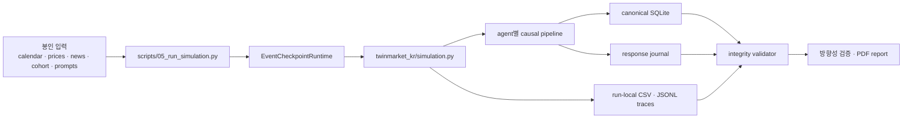
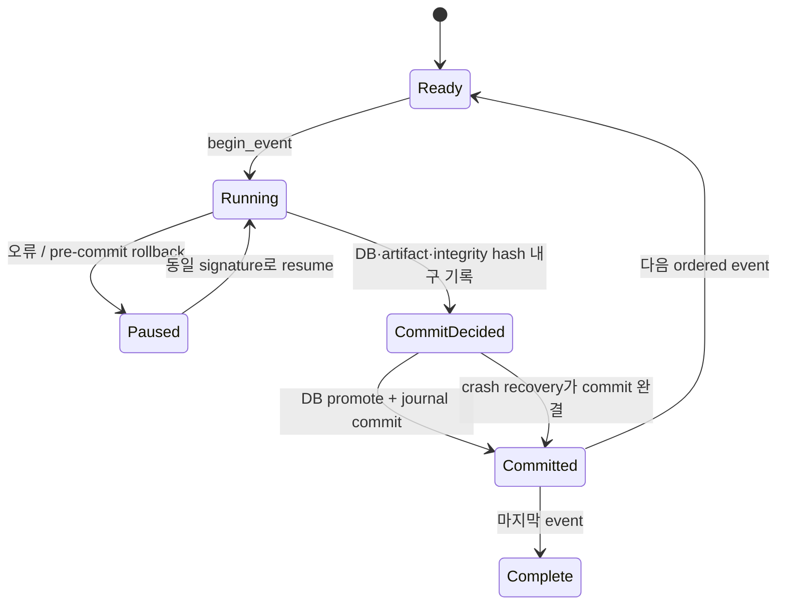
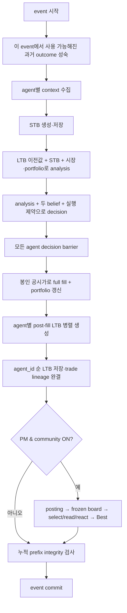
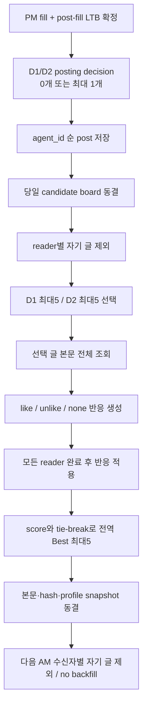
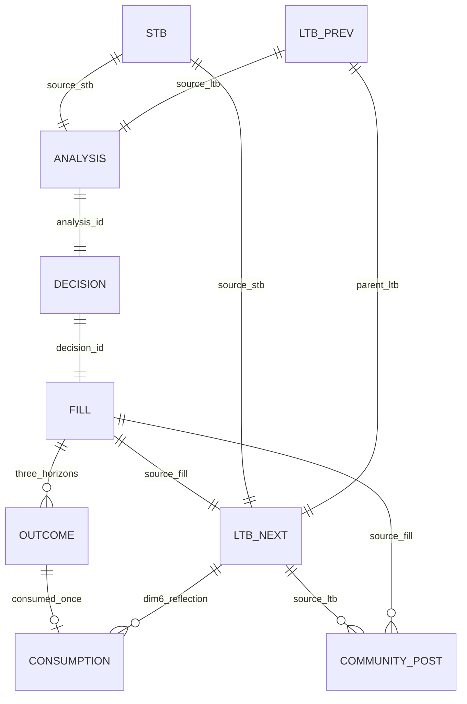

# AICP 3.0 통합 실험 엔진 아키텍처

> 문서 성격: 코드 구현·인수인계용 기술 정본
> 기준 저장소: `sujin809/2026_AICP_ver3.0`, `sujin_0727`
> 기준일: 2026-07-29
> 현재 상태: 무과금 P0 리팩터링·재봉인·검증 PASS, 유료 live canary·45일 본실험은 별도 승인 전 NO-GO

이 문서는 AICP 3.0의 실제 실행 구조를 코드 수준에서 설명한다. 연구질문과
실험 조건의 통계적 의미는 `EXPERIMENT_DESIGN.md`, 운영 명령과 Go/No-Go
절차는 `RUNBOOK_AND_PREFLIGHT.md`를 따른다.

문서에서 다음 표현을 엄격히 구분한다.

- **현재 구현**: `scripts/05_run_simulation.py`에서 실제로 호출되는 코드
- **통합 계약**: 본실험 전에 반드시 만족해야 하는 구조적 불변조건
- **역사 근거**: 제거된 RN 전용 runtime의 Git history와 격리된 과거 artifact
- **파생 artifact**: canonical 상태에서 다시 만들 수 있는 CSV·JSONL·PDF
- **남은 gate**: clean/frozen tree의 승인 record, 유료 live telemetry와 45일
  본실험 승인, 또는 이후 code·prompt 변경 뒤의 새 candidate 재봉인처럼 구현과
  별도로 완료 증거가 필요한 항목

별도 상태 표시가 없는 1~19절은 현재 통합 구현과 본실험 계약을 함께 설명한다.
미커밋 working tree에서의 검증 범위와 아직 수행하지 않은 live 단계는 20절을
우선한다.

## 0. Git 기준점과 입력 근거

2026-07-29에 로컬 Git으로 다시 확인한 기준은 다음과 같다.

| 항목 | 확인값 |
| --- | --- |
| 원격 | `https://github.com/sujin809/2026_AICP_ver3.0.git` |
| 브랜치 | `sujin_0727` |
| 기준 HEAD | `f4e17956f39e0cb0d94974cb03684d68f5e53ce7` |
| 작성자 | `sujinjung <e62974347@gmail.com>` |
| 커밋 제목 | `RN Community A/B: 뉴스 재구축, 입력 봉인, D2 후보 풀 재정의` |
| 뉴스 정본 | `preparation/rn_ab_sealed_v1/news.json` |

`news.json`은 Git tracked이며 HEAD blob과 현재 파일의 blob이
`b3a7528f5f976c14662a056c46ed686a29e80ad1`로 같다. 따라서 수진이 만든 이
봉인 뉴스가 baseline 입력이라는 사실은 확인됐다. 45거래일·90 event,
760 slot, accepted shortage 59건, fake 0건이며 bundle SHA-256은
`a6fb61900c27071b2a79781478592d99d914482fbba0f4ecaafa73edcb8ab707`이다.

Git HEAD의 `study_spec.json`은 이전 상태를 가리키지만, 현 local profile은 새
candidate를 만든 뒤 candidate/official validator를 통과한 선택 파일만 반영해
다시 봉인했다. 이 과정에서 `news.json`은 byte-identical로 유지했고 5/3/2 quota와
no-backfill도 변하지 않았다. 다만 이 작업은 미커밋 working-tree의 무과금 검증이며
유료 provider telemetry, clean freeze 또는 live 실행 승인을 뜻하지 않는다. 이후
code·prompt·입력을 바꾸면 다시 candidate 재봉인·검증해야 하며, canary와 본실험은
여전히 **NO-GO**다.

---

## 1. 설계 목표와 비목표

### 1.1 설계 목표

1. 기존 번호형 파이프라인을 유지한다.
2. 실제뉴스 Community OFF/ON을 같은 실행기와 같은 상태 모델로 실행한다.
3. 에이전트의 현재 정보 반응과 누적 관점을 STB/LTB로 분리한다.
4. 거래 의도인 decision과 실제 체결인 fill을 분리한다.
5. 실제 fill 뒤에만 다음 거래용 LTB를 만든다.
6. 뉴스, 커뮤니티, belief, 거래, 가격 성과의 provenance를 ID로 연결한다.
7. AM 또는 PM+community event를 원자적으로 checkpoint하고 중단 후 재개한다.
8. 모델·provider·reasoning-off·입력·prompt·코드가 바뀌면 같은 run으로
   재개하지 못하게 한다.
9. 기간, 종목, agent 수, 뉴스 treatment를 파일 복사 없이 설정 축으로 확장한다.
10. validator와 PDF report가 동일한 run-local canonical 상태를 읽게 한다.

### 1.2 의도적으로 하지 않는 것

- 별도의 `rn_simulation.py`, `simulation_v3.py`, `new_runner.py`를 만들지 않는다.
- `simulation.py`에서 RN runner를 호출하는 얇은 wrapper로 통합을 대신하지 않는다.
- 가격 발견, 호가 경쟁, 부분 체결, 주문 대기열을 구현하지 않는다.
- 커뮤니티 글을 사실로 간주하지 않는다.
- 뉴스 부족분을 중복·미검증·합성 기사로 조용히 채우지 않는다.
- `belief_summary`를 6차원 belief 대신 거래 입력으로 사용하지 않는다.
- 미래 가격 성과를 현재 decision에 제공하지 않는다.
- 과거 `outputs/current`, 최신 파일 glob, 날짜가 박힌 복구 스크립트로 run을
  추측하지 않는다.

### 1.3 최상위 불변조건

아래 조건 중 하나라도 깨지면 해당 event 또는 run은 유효한 실험 결과가 아니다.

```text
한 agent·한 event
  = STB 1개
  = analysis 1개
  = decision 1개
  = full fill 1개
  = post-fill LTB 1개
  = portfolio state 1개

LTB_(t-1) + STB_t
  -> analysis_t
  -> decision_t
  -> fill_t
  -> LTB_t

LTB_t.visible_from_turn = t + 1
```

- action은 `buy` 또는 `sell`뿐이다.
- `filled_quantity = requested_quantity > 0`이다.
- AM은 봉인 시가, PM은 봉인 종가로 전량 체결한다.
- fee는 모든 계층에서 0이다.
- STB와 LTB는 같은 6개 차원을 가진다.
- LTB는 매 event마다 6차원 모두 새 문장으로 재귀 갱신한다.
- 성숙한 가격 outcome은 dim_6에서만 한 번 소비한다.
- PM 커뮤니티는 같은 PM의 post-fill LTB 이후에만 실행한다.

---

## 2. 시스템 컨텍스트



통합 본류의 호출 경로는 하나다.

```text
scripts/05_run_simulation.py
  ├─ sealed input 및 call policy 검증
  ├─ immutable run signature 생성
  ├─ EventCheckpointRuntime
  └─ twinmarket_kr/simulation.py
       ├─ core/daily_cycle.py
       ├─ agents/
       ├─ llm/
       ├─ community/
       ├─ outcome_schedule.py
       └─ run_logger.py
```

별도 checkpoint 실행기, RN 전용 09/12 실행기와 `twinmarket_kr/rn_ab`
runtime은 제거됐다. journal, StudySpec, sealing, reasoning-off gate와 pair
평가는 위 공통 경로가 직접 담당한다.

---

## 3. 정본과 파생물의 계층

같은 사실을 여러 파일에 독립적으로 쓰면 어느 값이 맞는지 판단할 수 없다.
따라서 source-of-truth 우선순위를 고정한다.

| 순위 | 계층 | 역할 | 변경 가능성 |
| --- | --- | --- | --- |
| 1 | 봉인 입력 registry | 실험 전에 확정된 외생 입력 | run 중 불변 |
| 2 | `run_signature.json` | 실제 선택된 입력·prompt·코드·정책 hash | run 생성 후 불변 |
| 3 | `.runtime/committed.db` | 완료된 event prefix의 canonical 과학 상태 | event commit 때만 교체 |
| 4 | response journal | logical call, 검증 응답, physical attempt, commit 상태 | append/상태 전이 |
| 5 | run-local trace | 실제 노출·호출·커뮤니티 delivery 상세 | event 단위 append |
| 6 | CSV·PDF·분석 JSON | 정본에서 생성한 분석 편의 산출물 | 재생성 가능 |

### 3.1 봉인 입력

현재 삼성전자 baseline은 `preparation/rn_ab_sealed_v1/`을 사용한다.

| 파일 | 의미 |
| --- | --- |
| `calendar.json` | 45거래일, AM/PM 90 event의 순서와 turn |
| `prices.json` | 각 event의 외생 체결가격 |
| `news.json` | event별 실제뉴스 slot, article/version/hash, shortage |
| `cohort.json` | 100명 agent와 depth 배정 |
| `study_spec.json` | 연구 정책과 registry hash |
| `stage_inputs.json` | event별 봉인 stage 입력 |
| `known_injection.json` | fake 주입 여부와 격리 근거 |
| `review.json` | 누수·출처 검토 결과 |
| `prompts/` | 해당 봉인 버전의 prompt 사본 |

현재 `05`는 model client 생성과 DB 변경 전에 공통
`validate_integrated_study_profile()`을 호출한다. 이 검증은 단순 hash 검사에
그치지 않고 다음 값을 fail-closed로 대조한다.

- 조건 allowlist와 Community-only treatment diff
- 100명 cohort ID·순서·depth 30/55/15·초기 현금 90/10
- structured persona projection과 production prompt hash
- 뉴스 목표 10·accepted shortage·D2 최근 7일/최대 5건
- STB/LTB cadence, fill 이후 LTB, next-turn/H1/H5
- buy/sell-only, full fill, 수수료·세금 0
- pinned model/provider, fallback 금지, strict reasoning off, 조건별 동시성 8

현 profile은 이 의미 검증과 `02`·`03`(read-only)·`04` 검증을 통과한 current
code·prompt·persona projection hash를 담는다. prompt 또는 production code가
다시 바뀌면 `scripts/15_seal_study.py`로 새 candidate profile을 만든 뒤 검증해야
하며, 이 검증만으로 live provider 동작을 증명할 수는 없다.

### 3.2 canonical DB와 trace의 경계

STB, analysis, decision, fill, LTB, portfolio, post, reaction은 SQLite가
canonical 상태다. 다만 현재 community의 reader별 `title_only`와
`full_body` exposure는 DB의 단일 interaction row만으로 전부 복원할 수 없다.
따라서 아래 두 run-local artifact도 현재 분석 정본의 일부다.

- `community_interactions.csv`
- `traces/community_exposure_trace.jsonl`

장기적으로는 exposure ledger를 DB에 승격할 수 있지만, 이번 리팩터링에서
새 원장을 하나 더 만들어 기존 artifact와 경쟁시키지 않는다.

---

## 4. 저장소와 모듈 경계

### 4.1 번호형 준비 파이프라인

| 단계 | 기본 파일 | 책임 |
| --- | --- | --- |
| 00 | `scripts/00_fetch_market_data.py` | 시장 원천자료 준비 |
| 01 | `scripts/01_build_persona.py` | 기본은 봉인 cohort/persona/depth 읽기 전용 검증; 명시 시에만 별도 DB에 새 cohort 생성 |
| 02 | `scripts/02_prepare_news.py` | sealed news·달력·가격·StudySpec 연결을 읽기 전용으로 검증한다. 이 스크립트에는 write 경로가 없다. |
| 03 | `scripts/03_load_stock_data.py` | 기본 `StockData` 읽기 전용 검증; `--write`와 명시한 source/target/profile이 있을 때만 적재 |
| 04 | `scripts/04_build_experiment_base.py` | `StockData`와 agent별 초기 portfolio·결정론적 LTB₀만 가진 clean base 생성 |
| 05 | `scripts/05_run_simulation.py` | 유일한 simulation 실행·재개 진입점 |

준비 단계가 모두 매 run마다 필요한 것은 아니다. 본실험은 검증된 base DB와
봉인 bundle을 입력으로 받고, `05`가 base DB를 run-local mutable DB로 복사한다.
뉴스 provenance와 최종 연구 profile을 새로 만들 때만
`13_bind_news_provenance.py -> 14_seal_news_bundle.py ->
15_seal_study.py`를 별도 versioned output에 실행한다. 즉 `02`는 새 뉴스를
만드는 단계가 아니라, 이 과정을 거쳐 봉인된 입력의 연결성을 확인하는
읽기 전용 gate다.

### 4.2 런타임 모듈

| 모듈 | 책임 | 하면 안 되는 일 |
| --- | --- | --- |
| `simulation.py` | event orchestration, barrier, fill, post-fill LTB, community | prompt parsing 세부 구현 |
| `core/daily_cycle.py` | agent 한 명의 STB→analysis→decision | 실제 fill·post-fill LTB 선행 생성 |
| `agents/news_agent.py` | sealed news projection와 D2 검색 | future/as-of 기사 노출 |
| `agents/memory_agent.py` | hierarchical state와 lineage 저장·검증 | summary만 다음 decision에 제공 |
| `agents/exchange_agent.py` | 제약을 통과한 주문의 공시가 전량 체결 | 시장가격 생성 |
| `community/agent.py` | post, profile snapshot, reaction, Best, log 저장 | 모델 호출 |
| `community/*.py` | posting/select/react/thinking prompt와 validation | DB 직접 임의 수정 |
| `llm/*.py` | stage payload, prompt, exact JSON validation | event commit 판단 |
| `outcome_schedule.py` | next-turn/H1/H5 시간 gate | 미래 outcome 조기 제공 |
| `experiment_runtime.py` | signature, lock, snapshot, checkpoint, integrity | 연구 내용 생성 |
| `run_logger.py` | run-local trace와 호환 CSV | canonical 상태를 추측 |

---

## 5. 실행 시작과 control plane

### 5.1 `05` 시작 순서

1. CLI를 파싱한다.
2. Community mode를 `off` 또는 `on`으로 확정한다.
3. 모델, provider, fallback, reasoning-off 정책을 검증한다.
4. `news.json`을 읽어 bundle/file/article/slot hash를 검증한다.
5. `calendar.json + prices.json`으로 `FrozenEventSchedule`을 만든다.
6. 뉴스의 ordered event ID와 schedule의 ordered event ID가 같은지 확인한다.
7. 날짜 범위와 agent subset을 결정한다.
8. base DB, persona DB, sealed input, prompt tree, production code tree,
   call policy의 hash를 계산한다.
9. 위 값을 canonical JSON으로 직렬화해 run signature를 만든다.
10. 새 run이면 base DB를 `.runtime/runtime_sim.db`로 복사한다.
11. resume이면 기존 signature와 byte-equivalent인지 확인한다.
12. `EventCheckpointRuntime`이 마지막 완료 prefix를 복구한다.

### 5.2 run signature 구성

signature에는 최소 다음 값이 들어간다.

- condition ID: `RN_COMM_OFF` 또는 `RN_COMM_ON`
- news treatment: 현재 `real_only`
- 종목코드
- 선택 시작일·종료일·거래일·ordered event ID
- agent ID 목록과 agent별 depth
- random seed
- information cutoff mode
- decision space
- simulation/API concurrency
- retry 정책
- fee
- D1/D2 read cap, Best 수
- 모든 봉인 입력 파일 경로와 SHA-256
- production prompt 파일별 SHA-256과 tree hash
- production code 파일별 SHA-256과 tree hash
- 모델·provider·reasoning-off body
- 초기 runtime DB SHA-256

resume 시 이 중 하나라도 달라지면 hard fail한다. “기간만 조금 바꾸어 이어서
돌리기”는 resume이 아니라 새 run이다.

### 5.3 lock

두 종류의 advisory lock을 사용한다.

- run-directory lock: 같은 run을 두 process가 동시에 진행하지 못하게 한다.
- runtime-DB lock: 같은 SQLite 파일을 두 simulation coroutine/process가 동시에
  mutation하지 못하게 한다.

두 lock은 성공, 예외, cancellation 모두 `finally`에서 해제한다.

---

## 6. event와 checkpoint 상태기계

### 6.1 원자 단위

```text
AM event = AM 거래 pipeline

PM event = PM 거래 pipeline + post-fill community lifecycle
```

PM 거래만 commit하고 community가 빠지는 상태는 Community ON 조건에서
유효한 완료 event가 아니다.

### 6.2 상태 전이



### 6.3 durable 파일

| 파일 | 역할 |
| --- | --- |
| `.runtime/runtime_sim.db` | 현재 process가 수정하는 working DB |
| `.runtime/committed.db` | 마지막 완료 event prefix의 durable DB |
| `.runtime/pending_commit.db` | commit decision 직전 검증된 다음 DB image |
| `.runtime/checkpoint.json` | completed prefix, inflight state, hashes |
| `.runtime/artifact_rollback/` | append artifact rollback용 event 전 snapshot |
| `run_signature.json` | immutable run identity |
| `paused.json` | 운영자에게 보이는 재개 정보 |
| `run_complete.json` | 전체 schedule만 생성 가능한 최종 marker |
| `segment_complete.json` | 명시적으로 줄인 무과금/부분 실행 marker |

### 6.4 running 중 중단

`commit_decided` 이전에 실패하면 다음을 수행한다.

1. `committed.db`를 working DB로 복원한다.
2. event 시작 뒤 append된 로그를 기존 byte prefix로 truncate한다.
3. event 중 rewrite된 artifact는 event 전 복사본으로 복원한다.
4. checkpoint의 inflight event를 제거하고 `paused`로 기록한다.
5. response journal의 이미 검증된 응답은 pending으로 보존해 같은 request에서
   재사용한다.

### 6.5 commit decision 이후 중단

`commit_decided`가 durable하게 기록된 뒤에는 rollback하지 않는다.

1. `pending_commit.db` 또는 같은 hash의 `committed.db`를 찾는다.
2. response digest 집합을 다시 검증한다.
3. journal logical response를 idempotent하게 committed로 바꾼다.
4. DB image를 `committed.db`로 승격한다.
5. completed event prefix에 정확히 한 event를 추가한다.

이 경계는 “DB는 새 event인데 journal은 이전 event” 같은 반쪽 commit을 막는다.

---

## 7. AM/PM event 실행 순서



### 7.1 agent 내부 병렬성

모든 agent의 STB가 끝난 뒤 전역 analysis barrier를 두는 구조가 아니다.

```text
Agent A: STB -> analysis -> decision
Agent B:      STB -> analysis -> decision
Agent C: STB --------> analysis -> decision
```

각 agent chain은 semaphore 안에서 독립적으로 진행한다. 전 agent가 decision까지
완료한 뒤에만 exchange barrier를 통과한다. 따라서 모델 응답 지연이 다른
agent의 causal input을 바꾸지는 않는다.

### 7.2 결정론적 저장 순서

LLM 호출은 병렬이어도 persistent ID와 DB 결과가 응답 도착 순서에 의존하면 안
된다.

- decision 결과를 모두 gather한 뒤 exchange를 실행한다.
- post-fill LTB는 병렬 생성 후 `agent_id` 순으로 저장한다.
- community posting은 병렬 생성 후 `agent_id` 순으로 post ID를 부여한다.
- 모든 reader는 같은 frozen board를 본다.
- reaction은 gather 후 `agent_id` 순으로 적용한다.
- Best tie-break는 결정론적으로 적용한다.

한 agent call이 실패해도 sibling task가 완전히 settle된 뒤 event 전체를
실패시킨다. 일부 agent만 저장된 채 다음 event로 넘어가지 않는다.

---

## 8. 6차원 STB/LTB 모델

### 8.1 차원 정의

| 차원 | 의미 | 최대 길이 |
| --- | --- | ---: |
| `dim_1` | 향후 약 1개월 삼성전자 주가 방향 전망 | 150자 |
| `dim_2` | 현재 valuation 관점 | 150자 |
| `dim_3` | 금리·환율·경기·반도체 업황 등 거시·산업 관점 | 150자 |
| `dim_4` | 시장 심리와 투자자 분위기 | 150자 |
| `dim_5` | persona에 따른 뉴스·커뮤니티 해석 | 150자 |
| `dim_6` | 자기 판단 능력, 반복 오류, 위험관리 성찰 | 150자 |

한도의 정본은 `config.BELIEF_LIMITS` 하나다(전 차원 150자). StudySpec 봉인과
검증기 모두 이 값을 읽는다. 과거 100자 한도는 라이브 재시도 33건 중 32건을
만들던 병목이라 150자로 통일했다.

STB와 LTB 모두 동일한 6차원을 사용한다. “short”와 “long”은 차원의 의미가
다르다는 뜻이 아니라 입력 범위와 사용 시점이 다르다는 뜻이다.

### 8.2 STB

STB_t는 현재 event에 새로 들어온 정보만 해석한다.
production template은 `prompts/update_short_term_belief.txt`이고
`twinmarket_kr/llm/belief.py::generate_short_term_belief()`가 typed
payload를 만든다.

허용 입력:

- structured persona
- 현재 event에 노출된 뉴스 제목
- depth에 따라 허용된 summary
- D2의 as-of-safe 추가 검색 결과
- 전일 선택/Best 원문에서 검증된 community claim

금지 입력:

- 이전 STB 또는 LTB
- 가격·기술지표
- 현금·보유량·portfolio
- 현재 또는 과거 fill
- 미래 또는 이미 성숙한 가격 outcome

STB가 이전 LTB를 보지 않는 이유는 오늘의 정보 반응을 누적 관점과 독립적으로
관찰하기 위해서다. 과거 관점과 통합하는 일은 analysis와 post-fill LTB가 맡는다.

### 8.3 analysis와 decision

analysis는 다음을 별도 필드로 받는다.

- `previous_ltb`: 직전 event 뒤 확정된 6차원
- `current_stb`: 현재 event의 6차원
- 시장 feature
- portfolio summary
- 실행 가능한 action과 최대 수량

analysis 결과에는 시장, valuation, 기술, 뉴스, portfolio, 위험, 기회,
confidence, directional stance와 evidence reference가 포함된다.

decision은 analysis와 두 belief를 이용해 다음을 만든다.

- action
- requested quantity
- reason
- risk control

`belief_summary`와 `view_change`는 이 causal 입력을 대체하지 않는다.

### 8.4 post-fill LTB

LTB_t는 같은 event의 실제 체결이 끝난 뒤 만든다.
production template은 `prompts/update_long_term_belief.txt`이고
`twinmarket_kr/llm/belief.py::update_long_term_belief()`가 이전 LTB,
현재 STB, 구조화된 fill과 due outcome을 서로 다른 필드로 전달한다.

```text
LTB_t = recursive_integrate(
    LTB_(t-1),
    STB_t,
    full fill_t,
    outcomes available at t
)
```

규칙:

- 매 event마다 호출한다.
- 6차원을 모두 새 문장으로 쓴다.
- 이전 문장을 그대로 복사하거나 `maintain`만 반환할 수 없다.
- current fill은 반드시 payload에 들어간다.
- 성숙한 과거 outcome은 dim_6에만 들어간다.
- dim_1~5는 current STB의 같은 차원 근거 범위를 넘을 수 없다.
- 저장된 LTB_t는 `visible_from_turn=t+1`이므로 같은 event decision에
  역으로 사용되지 않는다.

현재 DB는 fill 전달과 `source_fill_id` 계보를 강제한다. 다만 LLM이 dim_6
문장에 fill의 의미를 제대로 성찰했는지는 prompt-level 의미 검증 영역이다.
형식·계보가 맞는다는 사실과 성찰 내용이 좋은지를 구분해야 한다.

### 8.5 evidence

STB와 LTB의 각 차원은 다음 관계를 가진다.

```json
{
  "dim_1": {
    "support": ["evidence_id"],
    "contradict": []
  }
}
```

필수 검증:

- 허용 registry에 있는 ID만 사용한다.
- 같은 ID를 중복하지 않는다.
- support와 contradict 양쪽에 같은 ID를 넣지 않는다.
- LTB는 STB의 같은 차원 근거만 계승한다.
- outcome ID는 dim_6에 정확히 한 번만 존재한다.

현재 저장 계층은 LTB의 dim_1~dim_5가 현재 STB의 같은 차원 evidence와
support/contradict 관계를 그대로 보존하는지 검사한다. dim_6도 STB 근거
관계는 보존하고, 성숙한 outcome은 action-aligned markout 부호가 정한
support/contradict 관계에 정확히 한 번 들어가야 한다.

### 8.6 사람용 필드

`belief_summary`와 `view_change`는 저장된 LTB 6차원에서 결정론적으로 파생한다.

- `belief_summary`: 팀원이 로그를 빠르게 읽기 위한 통합 요약
- `view_change`: dimension별 before/after

두 필드는 human-log hash에는 포함되지만 다음 decision의 scientific input에는
포함되지 않는다.

---

## 9. 거래, fill, portfolio

### 9.1 action 공간

현재 baseline은 반응 방향을 보기 위해 hold를 허용하지 않는다.

```text
allowed action = buy 또는 sell
```

현금이 없어 buy가 불가능하거나 보유량이 없어 sell이 불가능하면 실행 가능한
방향만 허용된다. 두 방향 모두 불가능하면 임의 주문을 만들지 않고 event를
실패시킨다.

### 9.2 decision과 fill 분리

| 객체 | 의미 |
| --- | --- |
| decision | LLM의 거래 의도 |
| fill | 현금·보유량 제약을 적용한 실제 체결 결과 |

fill은 다음 정보를 가진다.

- fill ID와 decision ID
- agent, turn, date, subturn, stock code
- action
- requested/filled quantity
- executed price
- fee
- pre/post portfolio
- source LTB/STB
- scientific hash

### 9.3 체결 규칙

- AM: `prices.json`의 당일 시가
- PM: `prices.json`의 당일 종가
- 부분 체결 없음
- slippage 없음
- commission·tax 없음
- `fee = 0`

이 구조는 실제 시장 미시구조를 재현하는 것이 아니라 뉴스와 커뮤니티에 대한
buy/sell 반응을 측정하기 위한 외생가격 실험 장치다.

### 9.4 portfolio

각 fill 뒤 다음을 갱신한다.

- cash
- 종목별 quantity와 평균단가
- realized PnL
- 현재 공시가 기준 total value
- total return

event integrity는 음수 cash, 음수 position, 빠진 agent-event portfolio row를
허용하지 않는다.

---

## 10. 거래 성과 outcome과 시간 누수 방지

각 fill은 세 개의 관찰 horizon을 가진다.

| horizon | due 시점 |
| --- | --- |
| `next_turn` | 바로 다음 AM 또는 PM event |
| `H1` | 다음 거래일의 같은 subturn |
| `H5` | 5거래일 뒤의 같은 subturn |

### 10.1 lifecycle

```text
fill 생성
  -> future outcome placeholder
  -> due event 시작 시 sealed mark price로 matured
  -> due event의 STB/analysis/decision에는 미노출
  -> due event의 post-fill LTB dim_6에서 소비
```

due event 가격을 그 event decision 전에 보여 주지 않고 post-fill LTB에서만
사용하므로 leakage를 막는다. 이 설계는 같은 event의 거래까지 끝난 후 성찰하는
보수적 time gate다.

### 10.2 outcome 부호

성과는 fill action과 mark price를 결합한 방향 정렬 markout으로 해석한다.

- buy 뒤 mark price 상승: action-aligned positive
- buy 뒤 mark price 하락: action-aligned negative
- sell 뒤 mark price 하락: action-aligned positive
- sell 뒤 mark price 상승: action-aligned negative

가격 outcome만으로 dim_1~5를 뒤집지 않는다. 해당 결과는 자기판단과
위험관리를 다루는 dim_6에만 직접 반영한다.

### 10.3 right censoring

schedule 끝까지 horizon이 도래하지 않는 outcome은 `right_censored`로 남긴다.
부분 run, smoke, 중단 시에는 censoring하지 않는다. 전체 90-event fill grid가
완성된 뒤에만 수행한다.

100명·90 event 기준 기대량:

| 항목 | 수 |
| --- | ---: |
| fill | 9,000 |
| terminal outcome | 27,000 |
| matured·consumed | 25,700 |
| right-censored | 1,300 |

---

## 11. 실제뉴스와 depth

### 11.1 뉴스 정본

신규 runtime은 legacy selected-news CSV가 아니라
`preparation/rn_ab_sealed_v1/news.json`을 읽는다.

현재 bundle 특성:

- 90 event
- real article/slot 760개
- event 목표 10개
- 카테고리 목표: 종목 5, 섹터 3, 경제 2
- 59 event에 shortage 기록
- fake article 0개

`scripts/14_seal_news_bundle.py`는 각 카테고리 쿼터를 독립적으로 채운다.
종목이 4개이고 섹터가 4개여도 섹터 초과분으로 종목 부족분을 채우지 않으므로
해당 event는 9개다. 뉴스가 1~9개면 run을 중단하지 않고 실제 count, 부족
사유, 선택된 article/version/hash를 그대로 기록한다. 안전 기사 0개 event는
봉인 입력 생성 단계에서 실패한다. 조건 간에는 같은 bundle을 사용한다.

### 11.2 depth 권한

| Depth | 뉴스 기본 노출 | 추가 권한 |
| --- | --- | --- |
| D0 | event slot 제목 | 없음 |
| D1 | event slot 제목과 봉인 summary | 없음 |
| D2 | D1과 동일 | 허용 cutoff 내 최근 7일 keyword search, 최대 5건 |

여기서 뉴스 D2 검색 5건은 커뮤니티 선택 읽기 상한과 별개의 정책이다.
커뮤니티는 D1과 D2 모두 최대 5개이며, 뉴스 D1은 추가 검색을 하지 않는다.

100명 분포는 D0/D1/D2 = 30/55/15다. `data/sys_100_ko_ver5.db`의 structured
`news_depth`를 정본으로 persona prompt를 재생성해 100명 모두 prompt와 권한이
일치하도록 한다.

`--max-agents N`은 원 cohort의 앞 N명을 선택한다. 이는 agent-depth mapping을
바꾸지 않지만 30/55/15 비율을 보존하는 층화표본은 아니다. 축소 smoke의 결과를
100명 population 결과로 해석하면 안 된다.

### 11.3 시간 gate

AM과 PM은 event cutoff보다 늦게 알려진 기사를 볼 수 없다.

Sujin 뉴스 준비 코드가 정의한 노출 가능 시각은 다음과 같다.

```text
effective_at = max(published_at, last_modified_at)
```

- 수정시각이 없으면 `effective_at = published_at`이다.
- 수정시각이 있으면 해당 수정본은 `last_modified_at`부터 노출 가능하다.
- `scripts/13_bind_news_provenance.py`는 실제 7월 재크롤 시각을 사용하지 않고
  `observed_at = effective_at`으로 기록한다.
- 따라서 현재 bundle의 `observed_at`은 실제 수집기 관측 로그가 아니라
  **발행·수정 메타데이터로 정의한 노출 가능 시각**이다.
- `scripts/14_seal_news_bundle.py`는 이 시각을 기준으로 AM/PM slot을 배정한다.
- 봉인된 stage input의 cutoff는 AM 08:59, PM 15:30이다.

현재 `news.json`의 760개 기사는 모두 이 규칙을 따른다.

| 상태 | 기사 수 | 노출 가능 시각 |
| --- | ---: | --- |
| 수정시각 없음 | 509 | 발행시각 |
| 수정시각 > 발행시각 | 205 | 수정시각 |
| 수정시각 = 발행시각 | 46 | 두 시각이 같은 값 |

예를 들어 `news_20260227_종목_9d6d2df0`은 08:37에 발행됐지만
09:12에 수정되었다. 이 bundle의 `observed_at`도 09:12이고 PM slot에
배정된다. 따라서 AM D2 검색에서 이 기사를 보여주면 누수다.

runtime delivery와 D2 검색은 다음 조건을 모두 확인해야 한다.

1. `published_at <= event cutoff`
2. `observed_at <= event cutoff`
3. 값이 있으면 `last_modified_at <= event cutoff`
4. 해당 기사가 현재 cutoff까지 실제 봉인 slot에서 visible해졌음
5. D2 검색이면 published time 기준 최근 7일 window 안에 있음

공통 `NewsAgent.search_news_flat()`은 `published_at`,
`observed_at(=effective_at)`, `last_modified_at`, 최초 visible slot을 모두
검사하고 현재 event 기본 기사 ID를 제외한 뒤 최대 5건을 반환한다. 이 중 하나라도
빠지고 발행시각만 필터하면 미래 PM slot 기사가 AM 검색에 섞일 수 있으므로
관련 회귀를 유지한다.

방법론상 별도 한계가 있다. 현재 본문은 실제 `effective_at` 시점에 저장한
웹 아카이브 snapshot이 아니라 이후 재크롤한 본문이다. 따라서 논문과 보고서에서
`observed_at`을 “실제 과거 수집시각”이라고 표현하면 안 된다.
`cutoff_version_sha256`도 현재 본문과 effective time을 묶는 무결성 값이지,
그 시각의 웹 아카이브 존재를 독립적으로 증명하는 값은 아니다. 향후 입력을
재수집할 때는 실제 crawl timestamp와 versioned body snapshot을 별도 보존한다.

---

## 12. Community ON/OFF

### 12.1 OFF

OFF에서는 `CommunityAgent`를 만들지 않는다.

- posting 없음
- candidate exposure 없음
- selective reading 없음
- reaction 없음
- Best 없음
- community claim 없음

OFF에서 빈 community 파일이 생길 수는 있지만 과학 상태나 STB 근거가 생기면
안 된다.

### 12.2 권한

| Depth | 작성 | PM 선택 읽기 | 다음 AM Best |
| --- | --- | --- | --- |
| D0 | 불가 | 불가 | 자기 글 문제가 없는 Best 본문 전체 |
| D1 | 가능 | 최대 5개, 선택 0개 허용 | Best 본문 전체 |
| D2 | 가능 | 최대 5개, 선택 0개 허용 | Best 본문 전체 + 동결 상세 profile |

D1+D2가 70명이므로 능동 작성·선택·반응 가능 인원은 70명이다. D0도 Best
본문은 읽지만 글쓰기와 PM 선택·반응은 하지 않는다.

### 12.3 PM lifecycle



### 12.4 게시글

- D1/D2만 게시 여부를 판단한다.
- 작성은 강제하지 않는다.
- 한 agent가 한 PM에 최대 한 글을 쓴다. 이 제약은 제어흐름만 믿지 않고
  `community_posts`의 unique index `idx_community_posts_agent_date(agent_id, date)`로
  DB에서 함께 강제한다. table 정의에 `UNIQUE`를 넣으면
  `CREATE TABLE IF NOT EXISTS` 때문에 신규 DB만 제약을 갖게 되므로 index를 쓴다.
- 본문은 최대 500자다.
- 500자는 허용, 501자는 validation fail이다.
- 초과 본문을 자동으로 자르지 않는다.
- post는 post-fill LTB, LTB-linked view_change, structured PM fill을 활용한다.
- post 자체는 agent의 표현이며 fill 사실과 다르게 말할 수 있다.

post provenance:

- `source_ltb_id`
- `source_fill_id`
- `source_decision_id`

### 12.5 후보 화면과 원문

후보 화면은 `title_only`다.

포함:

- post ID
- 익명 닉네임
- 제목
- 글 유형
- like/unlike count
- 기존 score

제외:

- 본문
- private reasoning
- portfolio
- 최근 거래
- 작성자 평판 신호

작성자 badge는 구현하지 않는다. 과거 legacy runtime의 동적 badge 3종
(`상위 수익자`, `자산가`, `커뮤니티 인플루언서`)은 제거했다. 제거 이유는
§12.9에 적는다. 후보 화면에서 저자 쪽 신호는 익명 닉네임뿐이고, 닉네임은
`md5(agent_id)`에서 유도한 무정보 문자열이다. 당일 게시글의 like/unlike/score는
반응 전이므로 대체로 0이다. 따라서 후보 선택은 실질적으로 제목과 글 유형으로
이루어진다.

선택한 글만 `full_body`로 조회한다.

- D1: 원문 전체 + 익명 닉네임
- D2: 위 내용 + 후보 board 시점에 동결한 portfolio 요약·최근 fill 3건

즉 저자에 대한 추가 정보는 D2의 동결 profile 하나뿐이며, D1은 저자 관련
정보를 받지 않는다.

### 12.6 reaction과 Best

reaction:

- `like`
- `unlike`
- `none`

Best score:

```text
score = like_count - unlike_count
```

정렬:

1. score 내림차순
2. like count 내림차순
3. post ID 오름차순

양수 score 필터는 없다. 게시글이 5개보다 적으면 있는 글만 사용한다.

### 12.7 자기 글 제외

전역 Best 최대 5개를 먼저 확정한 뒤 수신자별로 자기 글만 제거한다.

- 6위 글로 backfill하지 않는다.
- 작성자는 최대 4개를 받을 수 있다.
- 다른 agent의 전역 rank는 바뀌지 않는다.

### 12.8 다음 AM

다음 AM에는 다음 full-body 정보가 community thinking의 입력이 된다.

- 전일 Best 원문
- 전일 직접 선택해 읽은 원문

같은 글이 두 관계에 모두 해당하면 본문은 한 번만 전달하되 exposure relation은
둘 다 남긴다.

- `best_full_body`
- `selected_full_body_replay`

두 relation은 원장에만 남는 라벨이 아니라 **둘 다 인용 가능한 근거 ID**다.
겹치는 글은 Best 항목에서 본문을 한 번만 직렬화하고 두 exposure ID를 같은
본문에 매핑하므로, claim은 어느 관계로든 그 글을 인용할 수 있다.

미선택 `title_only` 후보는 분석 로그에만 남고 claim이나 STB 근거가 될 수 없다.
따라서 community thinking 단계 자체도 full-body 노출(전일 Best 또는 직접 선택해
읽은 글)이 하나라도 있을 때만 실행한다. title-only 후보만 본 agent에게는
claim 단계를 열지 않는다.

### 12.9 badge를 두지 않는 이유

legacy runtime은 상위 20% 기준의 동적 badge 3종을 후보 화면과 full-body 화면,
다음 AM 요약에 함께 노출했다. 현재 baseline은 이를 제거했다. 근거는 다음과 같다.

- 세 badge 모두 임계값이 없어 상위 20% 인원을 무조건 채웠다. 누적 like가
  전원 0인 첫 PM에도 `agent_id` 사전순 앞쪽 20%가 `커뮤니티 인플루언서`를
  받았고, 그 라벨이 후보 선택 확률을 높여 실제 like·Best 진입으로 이어질 수
  있었다. 즉 평판 위계의 초기 조건이 agent ID 정렬 artifact였다.
- `자산가`는 절대 평가액 상위 20%였다. cohort의 초기자본은 1억 90명과
  10억 10명이므로 10억 집단이 사실상 고정으로 상위를 점유했다. 동적 평판이
  아니라 초기자본 티어 라벨로 동작했다.
- `커뮤니티 인플루언서`의 분모는 cohort 100명이 아니라 그날까지 글을 쓴
  agent 수여서, 다른 두 badge와 기준이 달랐고 인원이 매일 변했다.
- badge 규칙(비율·임계값·분모)은 어떤 정책 문서에도 없었고 봉인 StudySpec의
  `community_policy` 검증 대상도 아니었다. 처치의 일부인데 봉인되지 않은
  자유 변수였다.
- badge는 community mode ON에만 존재하므로 OFF/ON 처치와 완전히 교란된다.
  2-arm 설계에서 badge 효과를 분리해 주장할 수 없다.

제거 범위는 계산·저장·노출 전부다. `community/badge.py`, `config`의
`BADGE_*_PERCENTILE`, `author_badges` CSV 컬럼, 선택 프롬프트의 평판 참고
문구를 모두 삭제했다. 회귀 테스트가 네 렌더러와 선택 프롬프트에서 badge
문자열이 사라졌음을 확인한다.

---

## 13. canonical DB 계보

### 13.1 핵심 ER 구조



### 13.2 핵심 table

| table | cardinality | 핵심 key |
| --- | --- | --- |
| `simulation_stb_states` | agent-event당 1 | `stb_id`, unique(agent, turn) |
| `simulation_analyses` | agent-event당 1 | `analysis_id`, source LTB/STB |
| `simulation_decisions` | agent-event당 1 | `decision_id`, `analysis_id` |
| `simulation_fills` | agent-event당 1 | `fill_id`, `decision_id` |
| `simulation_ltb_states` | agent당 LTB_0 + event당 1 | parent/source IDs |
| `simulation_trade_outcomes` | fill당 3 | unique(fill, horizon) |
| `simulation_outcome_consumptions` | matured outcome당 1 | unique(outcome) |
| `portfolio_state` | turn 0 + agent-event당 1 | agent, turn |
| `trade_log` | fill 분석용 호환 ledger | analysis→LTB 전체 ID |
| `TradingDetails` | legacy 방향 분석 호환 | date, stock, agent, direction |
| `community_posts` | 게시한 경우, agent-PM당 최대 1 | source LTB/fill/decision, unique(agent, date) |
| `community_interactions` | reader-post reaction | reaction, unique(agent, post) |
| `community_logs` | agent-PM community snapshot | Best/read/candidate |

### 13.3 ID 규칙

현재 canonical 계보 ID는 agent와 turn에서 결정론적으로 유도한다.

```text
stb_A001_t001
analysis_A001_t001
decision_A001_t001
fill_A001_t001
ltb_A001_t001
```

정확한 문자열 포맷 자체보다 중요한 것은 같은 agent-event retry가 같은 ID와
같은 scientific hash를 만들고, 다른 event와 충돌하지 않는다는 점이다.

### 13.4 scientific hash와 human-log hash

- scientific hash: 6D, evidence, source IDs, structured decision/fill 등
  인과적 상태를 검증
- human-log hash: summary와 view_change 등 사람이 읽는 표현을 검증

사람용 wording만 바뀌어 scientific state가 바뀐 것처럼 보이면 안 된다.

---

## 14. response journal과 API 경계

### 14.1 목적

event 끝부분에서 네트워크가 끊겨도 이미 검증한 수천 개 응답을 다시 호출하면
비용과 재현성이 모두 악화된다. journal은 logical call과 physical attempt를
분리한다.

```text
logical call
  = run + condition + agent + event + stage + schema version

physical attempt
  = logical call + event attempt + provider request attempt
```

### 14.2 요청 identity

같은 logical response를 replay하려면 다음이 같아야 한다.

- rendered base prompt와 structured stage input
- model과 provider policy
- reasoning-off body
- response format
- temperature
- seed
- max tokens
- validation procedure version
- run signature

하나라도 달라지면 기존 응답을 재사용하지 않고 fail-closed한다.

### 14.3 acceptance

provider가 문자열을 반환했다고 accepted가 아니다.

1. exact JSON object로 parse한다.
2. duplicate key, NaN/Infinity, extra/missing key를 거부한다.
3. stage별 type, enum, 길이, evidence, ID 관계를 검사한다.
4. 통과한 canonical JSON만 journal에 `accepted/pending`으로 기록한다.
5. provider audit의 정확한 response hash와 acceptance event를 연결한다.
6. event commit 뒤 `committed`로 바꾼다.

validation retry 중 잘못된 provider 응답은 physical attempt로 남길 수 있지만
accepted scientific response로 세면 안 된다.

### 14.4 reasoning-off

OpenRouter 요청 직전 다음 body를 강제한다.

```json
{
  "reasoning": {
    "effort": "none",
    "exclude": true
  }
}
```

`exclude=true`만으로는 reasoning을 끈 것이 아니다. live telemetry가 다음을
모두 증명해야 한다.

- requested/returned model이 pin과 일치
- provider가 pin과 일치
- fallback 없음
- final request body의 effort가 `none`
- response reasoning field 없음
- `reasoning_tokens = 0`
- accepted response가 provider attempt hash와 연결

### 14.5 현재 상태

공통 `05`는 run-local `.runtime/response_journal.sqlite`를 생성하고 각
stage의 logical call을 event checkpoint scope에 묶는다. accepted response의
request hash가 같으면 resume 때 replay하며, 다른 payload가 같은 logical ID를
요청하면 fail-closed한다. event가 `commit_decided`가 되기 전에는 response를
scientific commit으로 간주하지 않는다.

이 구조와 offline replay/failpoint 회귀가 있다는 사실은 live provider가
strict reasoning-off를 지켰다는 증거가 아니다. live run은 별도의 canary
audit로 provider/model과 reasoning token 0을 증명해야 한다.

---

## 15. 로그와 artifact

### 15.1 run root

| 파일 | 용도 |
| --- | --- |
| `run_metadata.json` | resolved parameter, call policy, input 위치 |
| `run_signature.json` | immutable signature payload/hash |
| `agent_turns.jsonl` | 상세 context와 stage 결과 |
| `agent_turns.csv` | agent-event 요약 |
| `submitted_orders.csv` | decision에서 제출한 주문 |
| `exchange_fills.csv` | 실제 fill 분석 ledger |
| `daily_exchange_summary.csv` | event별 체결 집계 |
| `portfolio_updates.jsonl` | portfolio transition |
| `trade_outcomes.jsonl` | maturity/censor event |
| `community_posts.csv` | 게시글과 source IDs |
| `community_selection_inputs.csv` | reader별 frozen candidate board |
| `community_interactions.csv` | title/full exposure와 reaction |
| `community_best_posts.csv` | Best 본문/hash/delivery |
| `community_logs.csv` | agent별 community snapshot |
| `traces/community_exposure_trace.jsonl` | exposure provenance |
| `openrouter_calls.jsonl` | run-local provider/audit telemetry |
| `.runtime/response_journal.sqlite` | logical response와 physical attempt 상태 |
| `.runtime/checkpoint.json` | 완료 event prefix와 inflight/commit 상태 |
| `.runtime/committed.db` | 마지막 commit event까지의 durable canonical DB |
| `run_complete.json` | 전체 schedule 완료 증명 |

### 15.2 lineage 필드

거래·게시·exposure를 분석할 때 다음 ID를 함께 유지한다.

- source LTB ID
- source STB ID
- analysis ID
- decision ID
- fill ID
- post-fill LTB ID
- post ID
- exposure provenance ID
- news article/version/slot ID
- logical call ID

본문을 읽었는지 제목만 봤는지는 별도 필드다. `post_id`가 로그에 있다는
사실만으로 full-body exposure를 추정하면 안 된다.

### 15.3 파생물 생성 원칙

- report는 명시적 `--run-dir`만 받는다.
- `.runtime/committed.db`를 mutable working DB보다 우선한다.
- `run_complete.json`과 checkpoint integrity를 확인한다.
- 과거 global DB나 `outputs/current`로 fallback하지 않는다.
- CSV/PDF 생성 실패는 canonical run을 훼손하지 않는다.

---

## 16. event integrity

각 event의 commit 직전에 completed prefix 전체를 검사한다.

### 16.1 SQLite

- `PRAGMA quick_check = ok`
- foreign-key violation 0

### 16.2 agent-event grid

선택된 모든 agent와 완료된 모든 turn 조합에 대해 정확히 한 row:

- STB
- analysis
- decision
- fill
- LTB
- trade log
- portfolio

### 16.3 lineage

```text
analysis.source_ltb_id = previous LTB
analysis.source_stb_id = current STB

decision.analysis_id = analysis
decision.source_ltb_id = previous LTB
decision.source_stb_id = current STB

fill.decision_id = decision
fill.source_ltb_id = previous LTB
fill.source_stb_id = current STB

LTB.parent_ltb_id = previous LTB
LTB.source_stb_id = current STB
LTB.source_decision_id = decision
LTB.source_fill_id = fill
```

### 16.4 fill/portfolio

- buy/sell only
- positive requested quantity
- requested = filled
- positive sealed price
- fee 0
- stock code 일치
- cash와 position 비음수

### 16.5 outcome

- completed event까지 matured된 outcome은 모두 LTB가 소비
- 미래 event의 outcome consumption 없음
- 한 outcome의 중복 consumption 없음

검증 결과의 SHA-256은 `event_integrity_sha256[event_id]`로 checkpoint에 남긴다.

---

## 17. 검증과 보고서

### 17.1 데이터 무결성 gate

행동 지표를 계산하기 전에 다음을 통과해야 한다.

1. 전체 schedule complete marker
2. completed event 90개 연속 prefix
3. event integrity hash 90개
4. exact agent-event fill grid
5. fee 0 reconciliation
6. outcome maturity/consumption/censoring
7. community exposure/body/hash/self-exclusion
8. reasoning-off telemetry
9. sealed news exposure와 shortage 기록

### 17.2 개인수급 방향 검증

primary simulation 값:

```text
daily signed value
  = AM buy value - AM sell value
  + PM buy value - PM sell value

daily signed volume
  = AM buy quantity - AM sell quantity
  + PM buy quantity - PM sell quantity
```

이를 삼성전자 `005930`의 실제 Individuals 일별 순거래 방향과 비교한다.

현재 baseline:

- 승인 calendar 45거래일
- 첫 3거래일 burn-in
- 평가 42거래일

primary metric:

- direction match rate
- buy recall
- sell recall
- balanced accuracy

보조 metric:

- Pearson correlation
- cosine similarity
- max-abs normalization
- z-score normalization
- cumulative normalized path
- always-buy / always-sell
- 50:50 random
- actual-ratio random
- 전일 개인 방향
- 전일 시장 방향

AM/PM별 실제 개인수급 target은 없으므로 AM-only와 PM-only를 같은 일일
Individuals 방향에 비교하는 결과는 exploratory다. primary는 AM+PM 합산이다.

### 17.3 보고서

- `scripts/generate_run_report_pdf.py`
- `scripts/generate_community_report_pdf.py`
- `validation/validate_trading_direction.py`

보고서는 인과효과를 자동 주장하지 않는다. OFF/ON 차이는 동일 입력·동일
cohort·동일 call policy·동일 schedule이 검증된 뒤에만 community treatment
차이로 해석한다.

---

## 18. 확장 경계

### 18.1 종목

새 종목은 다음을 한 profile에서 함께 바꿔야 한다.

- stock code/name/exchange
- price registry
- trading calendar
- news registry와 query
- actual Individuals target
- report label

코드의 한 곳만 `005930`에서 바꾸는 방식은 허용하지 않는다.

### 18.2 기간

기간을 늘릴 때:

1. 새 calendar를 만든다.
2. AM/PM cutoff와 휴장일을 검토한다.
3. prices와 news event registry를 같은 순서로 만든다.
4. H1/H5 terminal censor count를 동적으로 계산한다.
5. 새 bundle을 봉인한다.

45일, 90 event, 9,000 fill을 loop 상수로 사용하지 않는다.

### 18.3 agent 수

기본은 100명이지만 설정으로 줄일 수 있어야 한다.

- agent ID→depth mapping은 바꾸지 않는다.
- 축소 subset의 composition을 metadata에 기록한다.
- STB/LTB 횟수는 agent_count × event_count에서 동적으로 결정한다.
- “90회”를 hardcode하지 않는다.

### 18.4 fake news

현재 baseline은 `real_only`다.

향후 treatment:

- `real_plus_bullish_fake`
- `real_plus_bearish_fake`

설계 원칙:

- 실제뉴스 slot은 유지한다.
- event당 목표 실제뉴스 10개 뒤 fake 1개를 추가할 수 있게 한다.
- fake label과 polarity는 agent에게 노출하지 않는다.
- 두 polarity는 factual anchor, event, 길이, 형식을 맞춘다.
- fake provenance는 사후 분석에서만 사용한다.
- baseline이 실제 개인 반응을 충분히 재현한 뒤 후속 실험을 실행한다.

---

## 19. fail-closed 규칙

다음 상황에서 조용히 보정하거나 계속하지 않는다.

- signature 또는 request hash drift
- 날짜/event 순서 불일치
- agent-depth-prompt 불일치
- sealed price와 DB price 불일치
- 미래/미관측 뉴스 노출
- STB에 forbidden context 유입
- analysis/decision/fill/LTB ID 계보 불일치
- hold 또는 0수량
- 부분 체결
- fee 비영
- outcome 조기 노출·중복 소비
- D0 posting/select/react
- D1 6개 또는 D2 6개 선택
- post 501자
- Best 자기 글 delivery
- title-only 본문 유출
- reasoning effort가 none이 아님
- provider/model fallback
- resume signature 불일치
- full schedule이 아닌데 run complete 또는 right censor 생성

뉴스 목표 10개 부족은 예외다. 이 경우는 부족 사유와 실제 count가 이미
봉인되어 있으면 기록하고 계속한다.

---

## 20. 현재 구현 상태·격리 경계·우선순위

### 20.1 working tree 판정

아래 표만 현재 구현 판정으로 사용한다. `무과금 PASS`는 해당 기능이 공통 번호형
경로에 있고 현 미커밋 tree에서 재봉인·회귀·offline 검증을 통과했다는 뜻이다.
이는 live provider 동작, clean freeze 또는 논문 결과를 증명하지 않는다.

| 영역 | 판정 | 현재 근거와 남은 gate |
| --- | --- | --- |
| Git·sealed news | 확인 | 수진 기준 HEAD와 Git tracked news blob 일치. 90 event, 760 slot, shortage 59건 |
| main news reader | 무과금 PASS | `05 -> simulation.py -> NewsAgent`가 sealed event ID를 직접 사용. D0 전체 headline, D1/D2 전체 제공 summary, D2 cutoff-safe 최근 7일 최대 5건. legacy pkl/CSV/JSON-split runtime reader는 제거됨 |
| 뉴스 quota | 무과금 PASS | sealer가 종목 5·섹터 3·경제 2를 독립 적용하고 카테고리 간 backfill을 금지. 1~9건은 shortage 기록 후 실행 지속, 0건은 입력 봉인 실패. 재봉인 중 news bytes는 불변 |
| Community 정책 | 무과금 PASS | D0 수동 참여 0/Best 본문 수신, D1·D2 선택 최대 5, 글 500자, full-body Best, self-exclusion/no-backfill과 exposure 로그가 공통 모듈에 연결됨. badge 3종은 §12.9 근거로 계산·저장·노출 전부 제거. agent-PM 1글은 unique index로 DB 강제. Best∩선택 중복 글은 본문 1회 직렬화 + 두 exposure ID 모두 인용 가능 |
| STB/LTB·decision/fill | 무과금 PASS | 별도 STB/LTB prompt와 `previous LTB + current STB -> analysis -> decision -> fill -> post-fill LTB` 계보가 공통 DB에 연결됨. prompt wiring 회귀 포함 전체 suite PASS |
| outcome | 무과금 PASS | next-turn/H1/H5가 frozen schedule의 due event에서만 dim_6에 1회 소비되고 terminal right-censor 처리됨 |
| event checkpoint·journal | 무과금 PASS | `EventCheckpointRuntime`, run signature, `.runtime/committed.db`, response journal, running rollback과 commit-decided recovery가 `05` 기본 경로에 연결됨. provider JSON은 최초 수신부터 canonical key order로 정규화하고, 1 agent/45거래일 OFF/ON 실제 중단·재개 offline 검증과 failpoint/resume 회귀를 통과함 |
| StudySpec·cohort/persona | 무과금 PASS | 현 code·prompt·persona projection으로 candidate를 재봉인하고 official profile까지 `02`·`03`(read-only)·`04`를 통과. 100명·30/55/15·90/10을 exact-match |
| validator·report | 무과금 PASS | `99_validate.py`와 두 PDF generator는 explicit `--run-dir`만 읽고 run 밖 `derived/`만 쓴다. 파생 output guard와 3종 fixture PDF 시각 검수를 통과했으며 live full-run artifact는 아직 없음 |
| strict reasoning-off | 정적 gate 구현 / live 미증명 | 모든 production request 정책은 `effort=none`, `exclude=true`, pinned provider/model, fallback 금지. paper run에는 별도 live canary audit가 필요 |
| 재봉인·canary·본실험 | **재봉인·무과금 PASS / live NO-GO** | 새 code/prompt hash 봉인과 전체 회귀는 완료. 승인된 live canary와 45일 run은 유료 권한이 없어 수행하지 않음 |

무과금 PASS는 구현·봉인·offline 동작의 근거일 뿐 논문 결과나
publication-ready 판정으로 인용하지 않는다. live 전에는 의도한 diff를 freeze하고
승인 record를 남긴 뒤, 같은 profile로 유료 canary와 별도 45일 pair를 수행한다.

### 20.2 active·임시·격리 영역

앞으로의 active 경로:

- `scripts/00_*`부터 `scripts/05_run_simulation.py`
- `twinmarket_kr/simulation.py`와 공통 `core/`, `agents/`, `community/`,
  `llm/`, `db/`
- 최상위 production `prompts/`
- `preparation/rn_ab_sealed_v1/`의 봉인 입력과 hash가 참조하는
  cohort/persona/registry
- 공통 회귀 테스트, canonical validator·exporter·report
- `README.md`, `ARCHITECTURE.md`, `EXPERIMENT_DESIGN.md`,
  `RUNBOOK_AND_PREFLIGHT.md`

과거 RN 전용 runtime과 전용 tests는 working tree에 남기지 않는다. 삭제된
구현의 역사는 Git history로 확인하며, 현재 동작은 공통 모듈 테스트로만
회귀 검증한다. `scripts/13_bind_news_provenance.py`,
`scripts/14_seal_news_bundle.py`, `scripts/15_seal_study.py`는 RN 실행기가
아니라 현재 봉인 입력 준비 단계다.

신규 실행에서 격리하는 영역:

- `archive/legacy_docs/`의 과거 설계·검증·연구 provenance
- `archive/legacy_inputs/`의 과거 NO-GO 입력 후보와 persona snapshot
- `archive/legacy_results/`의 과거 실행 결과
- legacy selected-news CSV
- 날짜가 박힌 과거 복구 entrypoint
- 과거 `outputs/`, `outputs/current`, 분석용 과거 DB·CSV·PDF

과거 결과와 사용자 데이터는 삭제 대상이 아니다. read-only 분석 자료로 보존할
수 있지만 active input과 물리·논리적으로 분리하고 새 runtime이 읽지 못하게
한다. 과거 runtime을 archive 실행기로 복제하지 않고 필요하면 Git history에서
복구한다.

임시·과거 runtime 삭제 전에는 production import, script call, test fixture,
문서 link를 `rg`로 확인한다. 참조가 0이고 대체 테스트가 통과한 코드·문서만
제거한다. 입력, 사용자 데이터, 과거 run 결과는 이 정리 절차로 삭제하지 않는다.

### 20.3 알려진 gap과 우선순위

이 표는 기능 이식 TODO가 아니라 **현재 남은 실행 승인 gate와 확장 과제**다.
P0는 live 실행 전에 모두 해결해야 한다.

| 우선순위 | 항목 | 의미 |
| --- | --- | --- |
| P0 | final tree 안정화 | **무과금 범위 완료**: active 경로의 legacy 참조·중복 schema·깨진 문서 link를 검사하고 과거 분석/validation artifact를 archive로 격리. `preparation/GENERATED_INPUT_CONTRACT.md`는 활성 코드 참조가 0이고 현행 D2 profile 정책과 충돌해 `archive/legacy_docs/`로 격리함. live freeze는 별도 승인 record가 필요 |
| P0 | 전체 무과금 회귀 | **완료**: 전체 `pytest -q` 167 passed, 17 subtests passed; official profile 1 agent/45거래일 OFF/ON 실제 중단·재개 offline 검증과 checkpoint/resume 회귀를 기록. badge 제거·exposure relation·unique index 변경 뒤 새 manifest로 45거래일 90 event offline E2E를 OFF(1 agent)·ON(3 agent)·ON(7 agent, D2 포함)으로 재실행. OFF는 community 원장 4종 0행, ON은 agent-PM 1글·자기 글 반응 0·score 정합·agent×PM 격자·500자·Best 예정=실제 delivery·마지막 PM right_censored·`title_only`/`full_body` 분리·D2만 detailed profile 수신·D1 profile 누출 0·badge 흔적 0을 모두 통과 |
| P0 | 최종 재봉인 | **완료**: production prompt·code·persona projection hash를 candidate에 반영하고, news byte equality 확인 뒤 official selection/review를 갱신 |
| P0 | reasoning-off live canary | **대기**: 승인된 1회 유료 호출로 provider/model, request reasoning 객체, 빈 reasoning, reasoning token 0을 증명. badge 제거로 prompt·schema·policy가 바뀌었으므로 RUNBOOK §10에 따라 이전 manifest 기준 canary는 재사용할 수 없고 새 manifest로 수행한다 |
| P0 | report final rehearsal | **무과금 범위 완료**: `99_validate`/방향성 검증의 external output guard와 3종 fixture PDF를 run 밖 `derived/` 경로에서 QA. real complete run report는 live 본실험 뒤 생성 |
| P1 | fake profile 준비 | real 10(+shortage 그대로)+fake 1의 bullish/bearish 별도 sealed profile과 pair 검증 |
| P1 | instrument 일반화 | stock code/name, 뉴스, 가격, target, persona 문구와 report label을 하나의 새 profile로 봉인 |
| P1 | 기간·cohort 일반화 | 날짜·agent 수 변경 시 별도 cohort/calendar/profile을 만들고 baseline hash를 재사용하지 않음 |
| P2 | compatibility context 정리 | causal 입력이 아닌 legacy order/system-message 조회를 token·유지보수 관점에서 후속 검토 |

live canary는 명시적 유료 승인 전 NO-GO다. canary가 통과해도 45일 본실험은
별도 비용·기간·run ID 승인 없이는 시작하지 않는다.

---

## 21. 파일별 변경 가이드

| 변경 목적 | 우선 파일 | 함께 확인할 테스트 |
| --- | --- | --- |
| event 순서·resume | `scripts/05_run_simulation.py`, `experiment_runtime.py` | `test_experiment_checkpoint_runtime.py` |
| STB/LTB | `llm/belief.py`, `agents/memory_agent.py` | `test_hierarchical_memory.py` |
| analysis/decision/fill | `core/daily_cycle.py`, `llm/analysis.py`, `llm/decision.py`, `simulation.py` | lineage tests |
| outcome | `outcome_schedule.py`, `memory_agent.py` | `test_simulation_outcomes.py` |
| sealed news | `agents/news_agent.py` | `test_sealed_news_agent.py` |
| cohort/depth | `memory_agent.py`, persona loader | `test_simulation_cohort.py` |
| community | `community/*`, `simulation.py`, `run_logger.py` | `test_community_policy.py` |
| reasoning/journal | `llm/client.py`, `llm/response_journal.py`, checkpoint | call-policy/journal tests |
| 방향 검증 | `validation/validate_trading_direction.py` | `test_direction_validator.py` |
| PDF | `scripts/report_common.py`, report generators | `test_report_lineage.py` |

코드 변경 시 prompt, schema, validator, logger, report 중 하나만 바꾸고 끝내지
않는다. 한 정책을 소비하는 모든 경계를 함께 검사한다.

---

## 22. 완료 정의

다음 증거가 모두 있어야 GitHub에 올릴 통합 baseline으로 본다.

- 번호형 `00→05`가 유일한 신규 실행 경로
- main production의 `twinmarket_kr.rn_ab` import 0
- sealed input과 current code/prompt hash 재봉인
- OFF/ON의 허용 차이가 community mode뿐임을 검증
- 100명 × 전체 event canonical grid
- STB→analysis→decision→fill→post-fill LTB→PM community 계보 전수 PASS
- next-turn/H1/H5 maturity·consumption·censoring PASS
- D0/D1/D2 뉴스·community 권한 PASS
- response replay와 event rollback/commit recovery PASS
- strict reasoning-off live telemetry PASS
- explicit-run validator와 두 PDF 생성 PASS
- 실제 Individuals 방향 45일/42일 분석 생성
- 불필요한 duplicate runner, hardcoded repair script, stale root 문서 정리
- 유료 API 호출·commit·push는 별도 승인 뒤 수행

이 완료 정의를 만족하기 전의 offline smoke 성공은 구현 검증 근거이지 논문
결과가 아니다.
